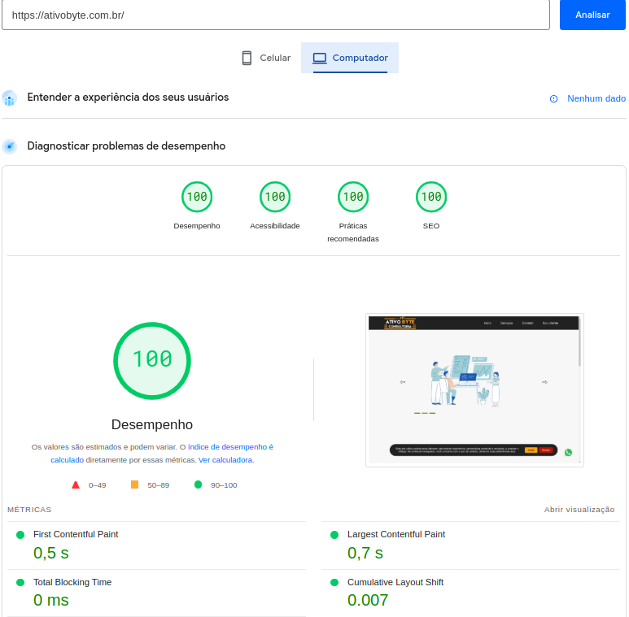
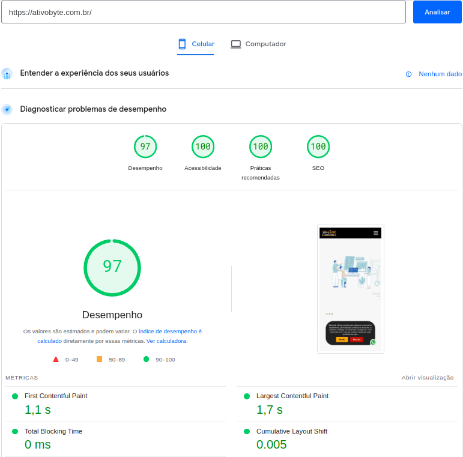

# 💻 Ativo Byte - Site de Consultoria de Software 🚀  

**Ativo Byte** é um site responsivo e otimizado, projetado para destacar serviços de consultoria de software. Este projeto combina design moderno, alta performance e uma experiência de usuário incrível tanto em desktops quanto em dispositivos móveis.  

## ✨ Funcionalidades Principais  

### 🎡 Carrossel Interativo  
- **Navegação com Botões**: Use os botões de **➡️ Próximo** e **⬅️ Anterior** para navegar.  
- **Pausa Automática**:  
  - 🖱️ **Desktop**: O carrossel pausa automaticamente quando o mouse está sobre ele.  
  - 📱 **Mobile**: Toques longos ou cliques pausam o carrossel.  
- **Gestos Touch**:  
  - Deslize o dedo **para a direita** ou **para a esquerda** para navegar no carrossel.  
- **Retomada Automática**: Após **10,8 segundos** sem interação, o carrossel volta a girar automaticamente.  

### 🧭 Barra de Navegação Simples  
- Links rápidos para as seções principais do site:  
  - 🏠 **Início**  
  - 🛠️ **Serviços**  
  - 📬 **Contatos**  
  - 🔒 **Área do Cliente**  
- Transições suaves implementadas com **scroll-behavior**, garantindo navegação fluida.  

### 📱 Design Responsivo  
- Funciona perfeitamente em:  
  - 💻 **Desktops**  
  - 📱 **Smartphones**  
  - 📊 **Tablets**  
- Imagens otimizadas para diferentes resoluções, oferecendo carregamento rápido e design adaptado.  

## 🎨 Tecnologias Utilizadas  
- **HTML5**: Estrutura semântica moderna.  
- **CSS3**: Estilos responsivos e personalizados.  
- **JavaScript**: Carrossel interativo e navegação suave.  
- **Scroll Behavior**: Para transições elegantes entre seções.  

## 📸 Teste feito no site
[PageSpeed](https://pagespeed.web.dev/analysis/https-ativobyte-com-br/enfjglmrpl?hl=pt-BR&form_factor=mobile) 

### 💻 Desktop  
  
### 📱 Dispositivos Móveis  
 
 